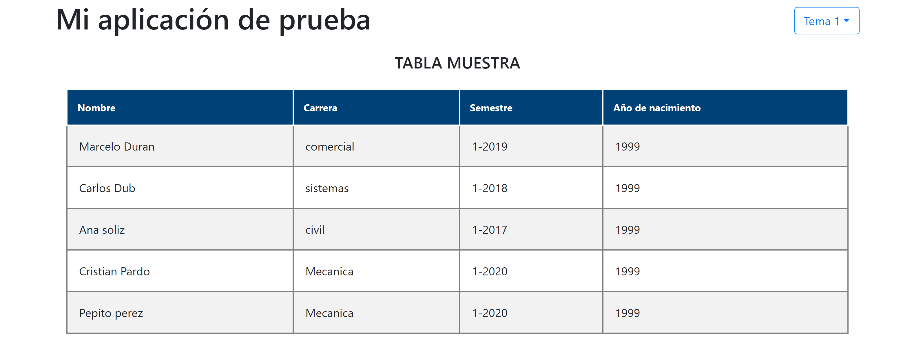

# TableAngular

## ¿Qué es?
Este proyecto consiste de una tabla responsiva. Esta tabla es genérica y reutilizable, puede funcionar con distintas cantidades de filas y columnas.

A su vez, cuenta con un selector de tema. Al cambiar el tema, cambian los colores de la tabla y el título. El tema seleccionado persiste al refrescar la página.

Este proyecto fue generado con [Angular CLI](https://github.com/angular/angular-cli) versión 11.0.7.

## Requisitos
- [NodeJS](https://nodejs.org/es/)
- [Angular](https://angular.io/)

## Instrucciones
1. Clonar el repositorio con `git clone https://github.com/ronaldescobarjaldin/table-angular`
2. Instalar las dependencias con `npm install`
3. Hacer correr la aplicación con `ng serve -o`

## Comandos
Para instalar las dependencias ejecutar el comando:

    npm install

Para hacer correr el proyecto localmente, ejecutar el comando:

    ng serve

Se ejecutará localmente la aplicación en [localhost:4200](http://localhost:4200). Si se agrega el flag `-o` se abre automáticamente el navegador en esa URL.

Para generar un nuevo componente usando Angular CLI, ejecutar el comando:

    ng generate component nombre-del-componente

Para compilar/transpilar el código, ejecutar el comando:

    ng build

Esto generará el código compilado/transpilado en la carpeta `dist`. Agregar el flag `--prod` para que el código generado sea para producción.

## Librerías/extensiones utilizadas
- [ng-bootstrap](https://ng-bootstrap.github.io/#/home)
- [SCSS](https://sass-lang.com/documentation/syntax)

## Captura de pantalla

